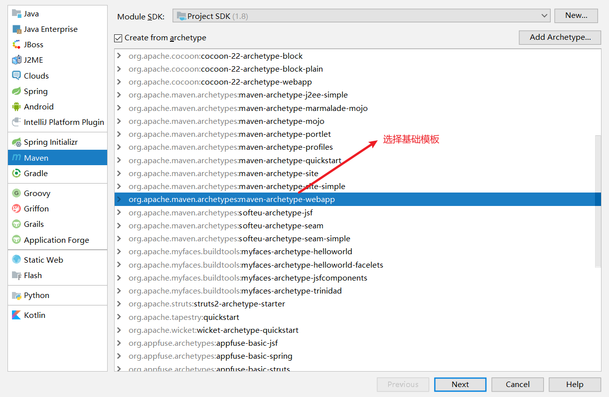
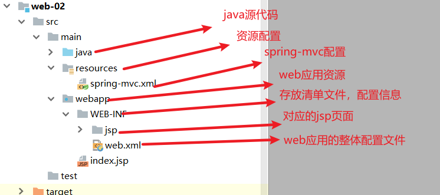
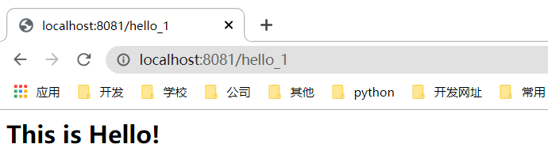
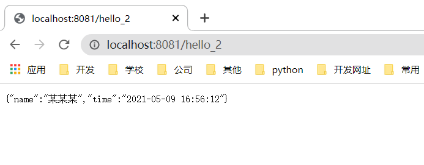

创建spring mvc 版本web项目为例

### 一、创建模板Maven项目

### 二、补齐目录结构

### 三、导入依赖包

~~~xml
<!-- 依赖的jar -->
<dependencies>
    <!-- spring-mvc -->
        <dependency>
            <groupId>org.springframework</groupId>
            <artifactId>spring-webmvc</artifactId>
            <version>5.2.7.RELEASE</version>
        </dependency>
    <!-- json转换器 -->
        <dependency>
            <groupId>com.alibaba</groupId>
            <artifactId>fastjson</artifactId>
            <version>1.2.68</version>
        </dependency>
    <!-- json -->
        <dependency>
            <groupId>com.fasterxml.jackson.core</groupId>
            <artifactId>jackson-databind</artifactId>
            <version>2.9.8</version>
        </dependency>
    <!-- 测试类 -->
        <dependency>
            <groupId>junit</groupId>
            <artifactId>junit</artifactId>
            <version>4.13</version>
            <scope>test</scope>
        </dependency>
</dependencies>

<!--Maven资源过滤 防止资源加载失败-->
<build>
    <resources>
        <resource>
            <directory>src/main/java</directory>
            <includes>
                <include>**/*.properties</include>
                <include>**/*.xml</include>
            </includes>
            <filtering>false</filtering>
        </resource>
        <resource>
            <directory>src/main/resources</directory>
            <includes>
                <include>**/*.properties</include>
                <include>**/*.xml</include>
            </includes>
            <filtering>false</filtering>
        </resource>
    </resources>
</build>
~~~

### 四、配置spring-mvc.xml、web.xml

1. spring-mvc.xml配置信息

   ~~~xml
   <?xml version="1.0" encoding="UTF-8"?>
   <beans xmlns="http://www.springframework.org/schema/beans"
          xmlns:xsi="http://www.w3.org/2001/XMLSchema-instance"
          xmlns:mvc="http://www.springframework.org/schema/mvc"
          xmlns:context="http://www.springframework.org/schema/context"
          xsi:schemaLocation="http://www.springframework.org/schema/beans
          http://www.springframework.org/schema/beans/spring-beans.xsd
          http://www.springframework.org/schema/mvc
          https://www.springframework.org/schema/mvc/spring-mvc.xsd
          http://www.springframework.org/schema/context
          https://www.springframework.org/schema/context/spring-context.xsd">
   
       <!-- 1.开启SpringMVC注解驱动 -->
       <mvc:annotation-driven>
           <!-- 配置json解析，防止乱码 -->
           <mvc:message-converters register-defaults="true">
               <bean class="org.springframework.http.converter.StringHttpMessageConverter">
                   <constructor-arg value="UTF-8"/>
               </bean>
               <bean class="org.springframework.http.converter.json.MappingJackson2HttpMessageConverter">
                   <property name="objectMapper">
                       <bean class="org.springframework.http.converter.json.Jackson2ObjectMapperFactoryBean">
                           <property name="failOnEmptyBeans" value="false"/>
                       </bean>
                   </property>
               </bean>
           </mvc:message-converters>
       </mvc:annotation-driven>
       <!-- 2.静态资源默认servlet配置-->
       <mvc:default-servlet-handler/>
   
       <!-- 3.配置jsp 显示ViewResolver视图解析器 -->
       <bean class="org.springframework.web.servlet.view.InternalResourceViewResolver">
           <property name="viewClass" value="org.springframework.web.servlet.view.JstlView"/>
           <property name="prefix" value="/WEB-INF/jsp/"/>
           <property name="suffix" value=".jsp"/>
       </bean>
   
       <!-- 4.扫描web相关的bean -->
       <context:component-scan base-package="zak.plus.controller"/>
   
   </beans>
   ~~~

2. web.xml

   ~~~xml
   <?xml version="1.0" encoding="UTF-8"?>
   <web-app xmlns="http://xmlns.jcp.org/xml/ns/javaee"
            xmlns:xsi="http://www.w3.org/2001/XMLSchema-instance"
            xsi:schemaLocation="http://xmlns.jcp.org/xml/ns/javaee http://xmlns.jcp.org/xml/ns/javaee/web-app_4_0.xsd"
            version="4.0">
   
       <!--1.注册DispatcherServlet-->
       <servlet>
           <servlet-name>springmvc</servlet-name>
           <servlet-class>org.springframework.web.servlet.DispatcherServlet</servlet-class>
           <!--关联一个springmvc的配置文件:spring-mvc.xml-->
           <init-param>
               <param-name>contextConfigLocation</param-name>
               <param-value>classpath:spring-mvc.xml</param-value>
           </init-param>
           <!--启动级别-1-->
           <load-on-startup>1</load-on-startup>
       </servlet>
   
       <!--/ 匹配所有的请求；（不包括.jsp）-->
       <!--/* 匹配所有的请求；（包括.jsp）-->
       <servlet-mapping>
           <servlet-name>springmvc</servlet-name>
           <url-pattern>/</url-pattern>
       </servlet-mapping>
   
       <!--2.配置乱码过滤器-->
       <filter>
           <filter-name>encodingFilter</filter-name>
           <filter-class>org.springframework.web.filter.CharacterEncodingFilter</filter-class>
           <init-param>
               <param-name>encoding</param-name>
               <param-value>utf-8</param-value>
           </init-param>
       </filter>
   
       <filter-mapping>
           <filter-name>encodingFilter</filter-name>
           <url-pattern>/*</url-pattern>
       </filter-mapping>
   
   </web-app>
   ~~~

### 五、编写测试代码

1. controller层（重在项目搭建、service和dao就不再编写）

   ~~~java
   import com.fasterxml.jackson.core.JsonProcessingException;
   import com.fasterxml.jackson.databind.ObjectMapper;
   import org.springframework.stereotype.Controller;
   import org.springframework.web.bind.annotation.GetMapping;
   import org.springframework.web.bind.annotation.RequestMapping;
   import org.springframework.web.bind.annotation.ResponseBody;
   import org.springframework.web.servlet.ModelAndView;
   import java.text.SimpleDateFormat;
   import java.util.Date;
   import java.util.HashMap;
   import java.util.Map;
   
   /**
    * @program: Java-web
    * @description:
    * @author: Acker
    * @create: 2021-04-30 22:33
    **/
   @Controller
   public class HelloController {
   
       // 响应页面
       @GetMapping("hello_1")
       public String page(){
           return "hello_1";
       }
   
       // 响应数据
       @GetMapping("/hello_2")
       @ResponseBody
       public Map<String,String> hello_2(){
           Map<String,String> map = new HashMap<String,String>();
           SimpleDateFormat sdf = new SimpleDateFormat("yyyy-MM-dd HH:mm:ss");
           map.put("name","某某某");
           map.put("time",sdf.format(new Date()));
           return map;
       }
   
       // 响应页面和数据
       @GetMapping("/hello_3")
       @ResponseBody
       public ModelAndView hello_3(){
           ModelAndView mv = new ModelAndView();
           // 设置页面
           mv.setViewName("hello_3");
           // 设置数据
           mv.addObject("name","某某某");
           SimpleDateFormat sdf = new SimpleDateFormat("yyyy-MM-dd HH:mm:ss");
           mv.addObject("time",sdf.format(new Date()));
           return mv;
       }
   }
   ~~~

2. hello_3.jsp页面（hello_1.jsp页面自行随意改写）

   ~~~jsp
   <%@ page language="java" import="java.util.*" contentType="text/html; charset=UTF-8"
            pageEncoding="UTF-8" %>
   <html>
   <body>
   <h2>${name}</h2>
   <h2>${time}</h2>
   </body>
   </html>
   ~~~

### 六、启动Tomcat测试

/hello_1

/hello_2

/hello_3

