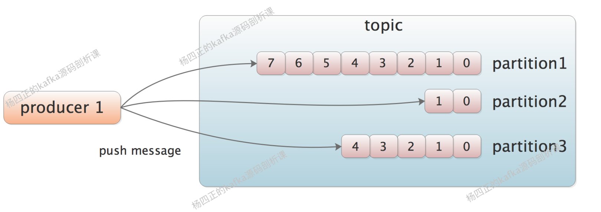

[Apache Kafka](https://cloud.tencent.com/product/ckafka?from=10680) 是一种[分布式消息系统](https://cloud.tencent.com/product/ckafka?from=10680)，由Scala语言编写而成。

# Kafak 基本概念（一）

## 一、message

message 是 Kafka 中最基本的数据单元，它由 key 和 value 两部分构成，KV 都为字节数组。

Kafka 会按照一定的策略，将消息按照 key 值路由到指定的 partition 中，从而保证 key 相同的 message 全部写入同一 partition 中。

value 是 Kafka真正传递的业务数据。

## 二、topic、partition、broker

topic 是 Kafka 中的一个逻辑概念，kafka 集群中可以定义多个 topic。

在使用的时候，producer 和 consumer 会约定好一个 topic 名称，producer 产生的 message 会写入到该指定的 topic 中，consumer 会从该指定的 topic 中读取 message。

topic 可以看做为一个 message 通道，连接多个 producer 和 consumer，如下图所示：

在 topic 这个逻辑概念中，kafka 做了进一步的拆分，将一个 topic 分为一个或多个 partition（一个 topic 至少有一个 partition），如下图所示：

从上图可以看出，当 message 在被 producer push 到一个 partition 的时候，都会被分配一个 offset 编号， offset 是这条 message 在这个 partition 中的唯一编号。

通过 offset 编号，kafka 就可以保证一个 partition 内的 message 是有序的，我们可以认为 partition 是一个用来记录有序 message 的存储。

在生产环境中，不同 topic 需要支持的流量大小有所不同，也就是说，topic 需要横向扩展的能力，kafka 就是通过 partition 来实现的。

同一 topic 的不同 partition 会分配到不同的物理机上，partition 是 topic 横向扩展的最小单位，一个 partition 中存储的这一组有序 message 没法存储到多台机器上。

常见的 kafka 架构如下图所示：

从上图中我们可以看到，多个 partition 位于同一个 broker 中，broker 其实就是一个 kafka server 服务，kafka 集群是由多个 broker 构成的。

我们可以通过增加 partition 以及 broker 的方式，提高 topic 的吞吐量。

这里的 broker 是 kafka 的核心之一，主要职责有下面核心三个：

- 接收 producer 发送过来的 message，并保存到磁盘中
- 处理 consumer 的请求
- 处理集群其他Broker的请求，根据请求类型进行相应处理并返回响应。  

## 三、log

了解了 partition、topic、broker 这个三个宏观概念之后，我们向微观方向进一步分析。

partition 在逻辑上对应着一个 log，当 producer 向 partition 推送 message 的时候，kafka 实际上是将 message 写入到 partition 对应的 log 中。

log 由多个 segment 构成，log 和 segment 都是逻辑上的概念。实际上，log 对应 磁盘上的一个文件夹，segment 对应 log 文件夹下的一个 segment 文件和一个 index 文件。

在写入 partition 时，我们只会写入最新的 segment 文件和 index 索引文件，当这个 segment 文件膨胀到一定大小之后，会创建新的 segment 文件继续写入，旧的 segment 文件就不再写入了。

之所以这么设计，为了避免出现超大的单个 segment 文件，也是为了采用顺序 IO 的方式写入，所以只向最新的 segment 文件追加数据。

再来看 index 文件，它是 segment 文件的一个**稀疏索引**的文件，在 kafka 运行过程中，会将 index 文件内容映射到内存中，提高索引速度。 

- **.log存储消息文件**
- **.index存储消息的索引**
- **.timeIndex，时间索引文件，通过时间戳做索引**

  

原文地址：https://cloud.tencent.com/developer/article/1821020
