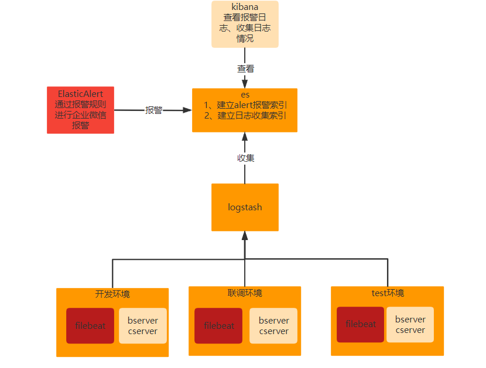

目的：实现自定义在开发、联调环境上面的日志报警，主要是通过企业微信通知

# 总体架构

总体思路借助成熟的日志采集系统ELK+ElasticAlert报警。
首先[filebeat](https://www.elastic.co/cn/beats/filebeat)采集bserver、cserver服务所对应日志文件，汇总到[logstash](https://www.elastic.co/cn/logstash/)上面进行统一处理，最好推送到[Elasticsearch](https://www.elastic.co/products/elasticsearch)，由[ElasticAlert](https://elastalert.readthedocs.io/en/latest/elastalert.html)进行一个规则匹配报警

# 搭建环境

后续说明

# Filebeat 

Filebeat 是一个用于转发和集中日志数据的轻量级传送器。作为代理安装在您的服务器上，Filebeat 监控您指定的日志文件或位置，收集日志事件，并将它们转发到[Elasticsearch](https://www.elastic.co/products/elasticsearch)或 [Logstash](https://www.elastic.co/products/logstash)以进行索引。 

  

 Logstash 是一个具有实时流水线功能的开源数据收集引擎。Logstash 可以动态地统一来自不同来源的数据，并将数据规范化到您选择的目的地。为各种高级下游分析和可视化用例清理和普及所有数据 